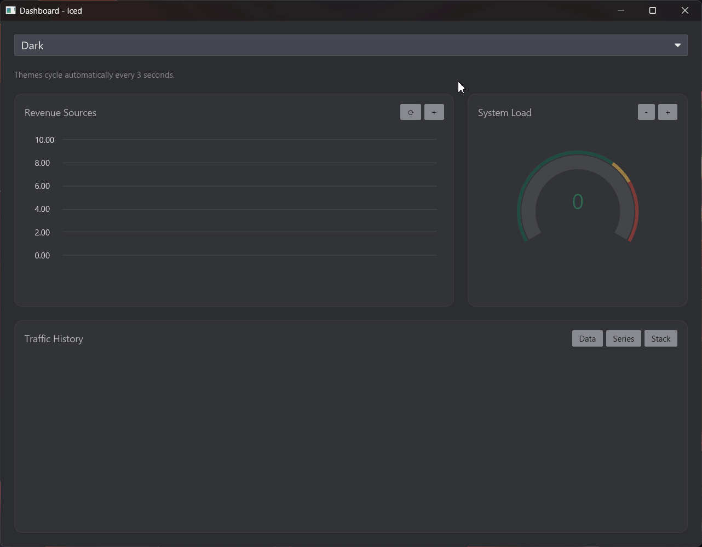

# 📊 Iced Aksel

<div align="center">

[![Built with Iced badge]][Iced]
[![Crate Badge]][Crate]
[![Docs-rs Badge]][Docs-rs]

</div>


`iced_aksel` is an experimental, "batteries not included", charting crate for
the [Iced] GUI toolkit, wrapping the [Aksel] plotting core in an ergonomic
widget. It focuses on rendering large, interactive datasets with customizable
axes, grids, styles, and event handlers that plug directly into your Iced
application logic.

> [!WARNING]
>
> The library is still pretty early in development. Breaking changes will occur
> as we iron out the API.



## 🔍 Highlights

- 📈 **Chart-first widget** – `Chart` provides layout and event handling that
  feels native to Iced apps.

- 🪓 **Powerful axes** – Configure positions, scales, tick/label policies,
  cursor labels, visibility, and grid renderers per axis.

- 🖌️**Canvas-like API** – Implement `PlotData` to add any shape primitive
  (`shape::Line`, `shape::Circle`, `shape::Rectangle`, etc.) to the plot - Or
  create your own shape primitives with the `Shape` trait!

- 📏 **Internal Transformation** - Handles all the math headaches associated
  with calculating screen- vs. plot-coordinates.

- 👉 **Rich interactivity** – Subscribe to click, drag, hover, scroll, and
  double-click callbacks for both the plot area and individual axes.

- 🎨 **Composable styling** – Override per-axis/plot styles or swap in entire
  `style::Catalog`s to match your own theming.

- 🔥 **Performant** - The library handles layering and mesh-squashing to ensure
  proper rendering while maintaining performance!

## 🔽 Install

Add the following to your `Cargo.toml`:

```toml
[dependencies]
iced = { version = "0.14" }
iced_aksel = { version = "0.1" }
```

## 🌟 Quick Start

```rust
use iced::{Element, Theme};
use iced_aksel::{
    axis, scale::Linear,
    Axis, Chart, Measure, Plot, PlotData, PlotPoint, State,
    shape::Circle,
};

const X_ID: &'static = "x_id";
const Y_ID: &'static = "y_id";

struct App {
    chart: State<&'static str, f64>,
    scatter: Scatter,
}

#[derive(Debug, Clone)]
enum Message {}

impl App {
    fn new() -> Self {
        let mut chart = State::new();
        chart.set_axis(X_ID, Axis::new(Linear::new(0.0, 100.0), axis::Position::Bottom));
        chart.set_axis(Y_ID, Axis::new(Linear::new(0.0, 100.0), axis::Position::Left));

        Self { chart, scatter: Scatter::demo() }
    }

    fn view(&self) -> Element<Message> {
        Chart::new(&self.chart)
            .plot_data(&self.scatter, X_ID, Y_ID)
            .into()
    }
}

struct Scatter {
    points: Vec<PlotPoint<f64>>,
}

impl Scatter {
    fn demo() -> Self {
        Self {
            points: vec![
                PlotPoint::new(10.0, 20.0),
                PlotPoint::new(50.0, 80.0),
                PlotPoint::new(90.0, 30.0),
            ],
        }
    }
}

impl PlotData<f64> for Scatter {
    fn draw(&self, plot: &mut Plot<f64>, theme: &Theme) {
        for point in &self.points {
            plot.add_shape(
                Circle::new(*point, Measure::Screen(5.0))
                    .fill(theme.palette().primary),
            );
        }
    }
}
```

### Core Concepts

- `Chart` is the widget that lays out axes and plots, and routes user events.
- `State` holds every axis definition and is shared between updates and
  rendering.
- `Axis` controls domain, scale, position, grid lines, cursor labels, and more.
- `PlotData` is implemented by your data structures; it receives a `Plot`
  builder to push shapes into.
- `Shape`, `Stroke`, and `Measure` describe how primitives are drawn.

## 🧩 Examples

The workspace ships multiple runnable examples that showcase axes, shapes,
interactions, dashboards, and stress tests. From the repository root:

```bash
# Core functionality examples
cargo run -p core_axes
cargo run -p core_interactions
cargo run -p core_scales
cargo run -p core_shapes
cargo run -p core_template

# Fancy Examples
cargo run -p candlestick
cargo run -p dashboard
cargo run -p spectrum
cargo run -p stress
```

Each example is a separate crate under `examples/` so you can copy-paste code
into your own application.

All examples can also be run in the web using `trunk`:

```bash
cd examples/core_axes
trunk serve
```

> [!IMPORTANT]
>
> Due to a
> [breaking change to getrandom](https://github.com/rust-random/getrandom/issues/671)
> you might have to enable the `wasm_js` backend for getrandom when running in
> WASM by setting the env-var: `RUSTFLAGS='--cfg getrandom_backend="wasm_js"'`
>
> This only applies to examples depending on `getrandom` (usually through
> `rand`).

## 💻 Development

- `cargo fmt` and `cargo clippy` enforce the workspace style (Clippy perf,
  correctness, complexity, and style lints are denied).

Contributions are welcome! Feel free to open issues with bug reports, feature
ideas, or performance traces that can help steer the roadmap.

> [!NOTE]
>
> A nix-devshell is also supplied in the `flake.nix` for Nix users.
>
> It can be started by running: `nix develop .`

<!-- LINKS -->

[Crate]: https://crates.io/crates/iced_aksel
[Crate Badge]: https://img.shields.io/crates/v/iced_aksel
[Docs-rs]: https://docs.rs/iced_aksel/latest/iced_aksel/
[Docs-rs Badge]: https://img.shields.io/docsrs/iced_aksel
[Built with Iced badge]: https://img.shields.io/badge/Built%20With%20Iced-3645FF?logo=iced&logoColor=fff
[Aksel]: https://github.com/QuistHQ/aksel
[Iced]: https://iced.rs/
